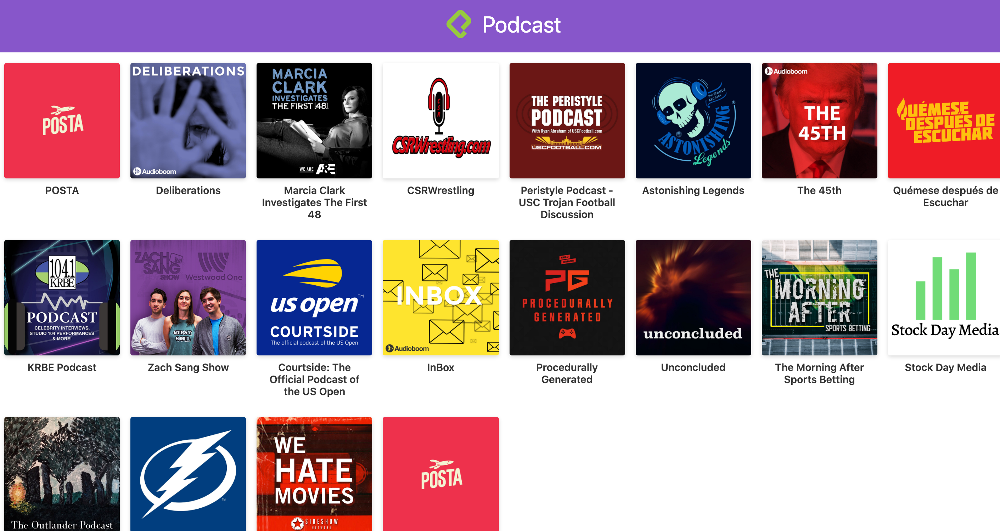

# App de Podcasts de Platzi

App de Podcasts integrada con la API de AudioBoom para aprender Next.JS

[Ver la aplicación](https://platzi-podcast-bgez99ptd.now.sh/)

## ¿Cómo funciona?

Requiere Node.JS

* `npm install` para instalar dependencias
* `npm run dev` para iniciar el entorno de desarrollo
* `npm run build && npm run start` para iniciar el entorno de producción

## Licencia

MIT